<p align="center">
  
</p>

<p align="center">
  <a href="https://fermartz.com">fermartz.com</a> &nbsp;|&nbsp;
  <a href="https://twitter.com/Fer_Martz">X / Twitter</a> &nbsp;|&nbsp;
  <a href="https://github.com/fermartz">GitHub</a> &nbsp;|&nbsp;
  <a href="https://delphy.network">Delphy</a> &nbsp;|&nbsp;
  <a href="https://astranova.live">AstraNova</a>
</p>

---

## > $ ABOUT

Personal site for **FERMARTZ** — an engineer building and shipping production AI products: agents, platforms, and the tools that drive them. Full-stack, end to end.

Built with **React 19 + Vite 6 + TypeScript**, styled with inline CSS, tested with **Vitest**, and fully deployed **100% onchain on the Internet Computer**.

### Featured Projects

- **Delphy** — The @identity for the agentic web. One URL any AI agent can read and act on — no scraping, no setup. Live at [delphy.network](https://delphy.network).
- **Delphy Agent** — A desktop hub to drive any AI backend (8 LLM providers + agent CLIs), extended through MCP plugins. Built with Tauri v2 + React 19.
- **AstraNova** — A living market universe where 12 AI agents trade, adapt, and evolve. Driven by 6 market forces, running in epochs and seasons. *(Paused.)*
- **Astra CLI** — Open-source terminal client to deploy any LLM as an agent into AstraNova. Provider-agnostic, security-first, zero config.
- **VibePop** — Personalized gift songs: turning someone's real story into a song made for exactly one person.

---

## > $ TECH STACK

| Category | Technologies |
|---|---|
| **AI & Agents** | Autonomous Agents, Multi-Agent Systems, MCP (servers + clients), RAG, Agentic Web |
| **LLM Providers** | Anthropic / Claude, OpenAI, Gemini, xAI, Vercel AI SDK, AWS Bedrock |
| **Languages & Frameworks** | TypeScript, Node.js, React, Next.js, Rust, Motoko, Python |
| **Blockchain & Web3** | Solana, Internet Computer, Bitcoin PSBTs, Chain-Key Cryptography |
| **Infrastructure** | AWS ECS Fargate, AWS CDK, S3, RDS, Docker, PostgreSQL, Supabase, DynamoDB |

---

## > $ DEVELOPMENT

```bash
# Install dependencies
npm install

# Start dev server
npm run dev

# Build for production
npm run build

# Preview production build
npm run preview

# Lint, typecheck, and run tests
npm run lint
npm run typecheck
npm run test
```

---

## > $ PROJECT STRUCTURE

```
fermartz.com/
├── index.html              # Entry HTML with full SEO metadata
├── package.json            # Vite + React 19 + TypeScript
├── tsconfig.json           # TypeScript config
├── vite.config.ts          # Vite config (with Vitest)
├── eslint.config.js        # Flat ESLint config
├── public/
│   ├── favicon.ico         # Multi-size favicon (16/32/48)
│   ├── og-image.png        # Social sharing image (1200x630)
│   ├── banner.png          # GitHub README banner
│   └── site.webmanifest    # PWA manifest
└── src/
    ├── main.tsx            # React root
    ├── App.tsx             # Site composition
    ├── theme.ts            # Color + font constants
    ├── types.ts            # Shared domain types
    ├── components/         # Page sections + shared UI
    │   └── music/          # Music player components
    ├── contexts/           # AudioPlayerContext
    ├── utils/              # Pure helpers (postLoader, audioHelpers, eqAnimation, ...)
    └── posts/              # MDX blog posts
```

---

## > $ DEPLOY

The `dist/` folder is a static site ready for any host. Currently deployed **100% onchain on the Internet Computer**.

---

<p align="center">
  <sub>BUILT BY FERMARTZ — 2026</sub><br/>
  <sub>100% ONCHAIN — INTERNET COMPUTER</sub>
</p>
