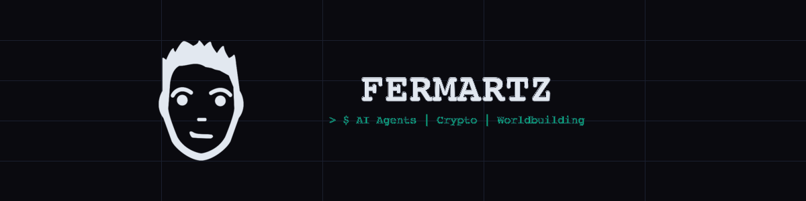

<p align="center">
  
</p>

<p align="center">
  <a href="https://fermartz.com">fermartz.com</a> &nbsp;|&nbsp;
  <a href="https://twitter.com/Fer_Martz">X / Twitter</a> &nbsp;|&nbsp;
  <a href="https://github.com/fermartz">GitHub</a> &nbsp;|&nbsp;
  <a href="https://astranova.live">AstraNova</a>
</p>

---

## > $ ABOUT

Personal site for **FERMARTZ** — solopreneur engineer building living systems at the intersection of AI agents, crypto, and creative worldbuilding.

Built with **React + Vite**, styled with inline CSS, and fully deployed **100% onchain on the Internet Computer**.

### Featured Projects

- **AstraNova** — A living crypto universe where 12 AI agents trade 24/7. Tick-based simulation engine with 3-second price updates, driven by 5 market forces, running in epochs and seasons.
- **Astra CLI** — Open-source terminal client to deploy AI agents into AstraNova. Provider-agnostic LLMs, security-first architecture, zero config.

---

## > $ TECH STACK

| Category | Technologies |
|---|---|
| **Languages & Frameworks** | TypeScript, Node.js, React, Next.js, Rust, Motoko, Python |
| **AI & Agents** | Anthropic, OpenAI, Gemini, AWS Bedrock, Vercel AI SDK, ElizaOS, MCP, RAG |
| **Blockchain & Crypto** | Solana, Internet Computer, Bitcoin PSBTs, Chain-Key Crypto, AMM Design |
| **Infrastructure** | AWS ECS Fargate, AWS CDK, S3, RDS, Docker, PostgreSQL, Supabase, DynamoDB |
| **Creative & Design** | SVG / Illustrator, Worldbuilding & Lore, Character Design |

---

## > $ DEVELOPMENT

```bash
# Install dependencies
npm install

# Start dev server
npm run dev

# Build for production
npm run build

# Preview production build
npm run preview
```

---

## > $ PROJECT STRUCTURE

```
fermartz.com/
├── index.html              # Entry HTML with full SEO metadata
├── package.json            # Vite + React 19
├── vite.config.js          # Vite config
├── public/
│   ├── favicon.ico         # Multi-size favicon (16/32/48)
│   ├── favicon-16x16.png
│   ├── favicon-32x32.png
│   ├── apple-touch-icon.png
│   ├── android-chrome-*.png
│   ├── og-image.png        # Social sharing image (1200x630)
│   ├── banner.png          # GitHub README banner
│   └── site.webmanifest    # PWA manifest
└── src/
    ├── main.jsx            # React root
    └── App.jsx             # Full site (single-file component)
```

---

## > $ DEPLOY

The `dist/` folder is a static site ready for any host. Currently deployed **100% onchain on the Internet Computer**.

---

<p align="center">
  <sub>BUILT BY FERMARTZ — 2026</sub><br/>
  <sub>100% ONCHAIN — INTERNET COMPUTER</sub>
</p>
